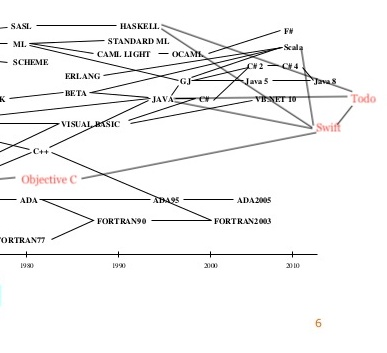

# Todo

Version 00x0.0.0.0.0.1.1.1

## Author and Credits

**Thomas Magnusson** - _All current work_ - [tommagnusson](https://github.com/tommagnusson)
**Daniel Gisolfi** - _Markdown template author_ - [dgisolfi](https://github.com/dgisolfi)

[TOC]

## Section 1 Introduction

Todo stands on the shoulders of design giants such as Swift, Rust, C, Python, Java, JavaScript, TypeScript, and many more countless modern languages whose subtle influences have inflitrated its design borders.

It is meant as a modern, general purpose, object oriented language for casual projects, and focuses on expressivity and orthogonality over performance or features.

Some of the main concepts it borrows:

- Static Typing from Swift, Rust, Java and TypeScript
- Mutable vs immutable variable references from Swift, Rust and JavaScript (e.g. `const` vs `let`)
- String interpolation from JavaScript and Swift
- Type inference from Swift and Rust
- `Struct` value semantics from Swift, Rust, and C
- Modules from like every modern language these days (JavaScript notably)

### 1.1 Genealogy



_Credit to: https://image.slidesharecdn.com/sestoft-compilerhistory-aau-infinit-20141124-141205074050-conversion-gate01/95/a-history-of-nordic-compilers-and-autocodes-6-638.jpg?cb=1417765345_

### 1.2 Hello World

The most basic of programs implemented in Todo.

```swift
// in hello.todo
public (args) => print("hello world")
```

`public` denotes the visibility of the closure. If there's only one public closure within a Module (in this case, the file) then it will be run. This is akin to a `main` function. Note the arrow closure notation like JavaScript, and the simple `print` function which is automatically available because every module implicitly imports the language library, which includes `print`.

```
$ todo hello.todo
$ hello world
```

### 1.3 Program structure

Todo key organizational concepts

- Files must have a name that ends in the file extension `.todo`
- Each file is automatically exported as a module unless it is broken up into modules within the file
- Each module implicitly imports

File `Recipe.todo`:

```swift
import Ingredients from './ingredients.todo'

// Struct types are pass-by-copy, but are passed around with
// shared pointers until they're written to (copy on write)
public struct Recipe {

    // note the 'get', meaning directions is read only externally
    // we are free to modify the directions internally though
    public get directions: String
    public get ingredients: [Ingredients]

    // this is a constructor which takes in two arguments
    // type is denoted using a colon after the parameter name
    Recipe(directions: String, ingredients: [Ingredient]) {
        // note self, taken from Swift, just like 'this' in Java or JavaScript
        self.directions = directions // equals = assignment...
        self.ingredients = ingredients;
    }

    // `pure` means that this function produces no side-effects, can only use read-only copies of variables
    public pure render = {
        // note the "string ${interpolation}" from JavaScript

        // can optionally be explicit about type using :
        let ingredientList: string = ingredients.map((i) => "<li>${i.toString()}</li>").reduce((i1, i2) => "${i1}${i2}")
        return "<p>${self.directions}</p><ul>${ingredientList}</ul>"
    }

    // every struct (and class) has a toString function
    // override is to override it
    // I'm assigning the render function to be its toString function as well
    public override pure toString = self.render
}
```

`Recipe.todo` only coincidentally has a `struct` of the same name declared inside of it. The `struct` `Recipe` would be used to render some directions and ingredients in a web application, perhaps. The constructor takes in directions and ingredients, and then has a `pure` render function which renders the HTML to display the two instance variables together. A caller who has imported this `struct` would call `let recipe = Recipe("Cook it", [new Ingredient("bacon")]` to create an instance of a recipe struct.

### 1.4 Types and Variables

Todo offers two main flavors of types: `struct` and `class`.

`struct` is the bread and butter of most data within a Todo program, and offers value semantics. They are meant to be lightweight, mostly read-only structures that hold information and contain the occasional convenience methods. They are pass by value, but are typically passed around through a pointer until written to, at which point they are copied and modified in the appropriate scopes.

`class` is the familiar, object-oriented reference type that offers inheritence and composition through `interface`s and `abstract class`es. It is meant for heavy objects such as connections to databases and pointers to large amounts of deeply nested data structures.

`struct` and `class` types are instantiated with very similar syntax and have many syntactic similarities, despite having wildly different performance impacts.

### 1.5 Statements

**Array Literals and Struct Instantiation**

In Todo:

```swift
// creates an array with one instance of ingredient within it
// and assigns it to ingredients
let ingredients = [Ingredient("1 juicy Lime"), Ingredient("1 large Coconut")]
let recipe = Recipe("Put the lime in the coconut and shake it all up", ingredients)
// let IS NOT the same as let in JavaScript...
// let IS THE SAME as in Swift (i.e. cannot reassign or redeclare)
let html = recipe.render()
```

In Java:

```java
Ingredient[] ingredients = new Ingredient[] {
    new Ingredient("1 juicy lime"),
    new Ingredient("1 large coconut")
};
Recipe recipe = new Recipe("Put the lime in the coconut and shake it all up", ingredients);

String html = recipe.render();
```

**String Interpolation**

In Todo:

```swift
let age = 20
let name = "Tom"
let greeting = "Hello ${name}, I heard you're ${age} years old"
print(greeting)
// "Hello Tom, I heard you're 20 years old"
```

In Java:

```java
int age = 20;
String name = "Tom";
String greeting = "Hello " + name + ", I heard you're " + age + "  years old";
System.out.println(greeting);
```

**Anonymous Function**

In Todo:

```swift
// there are no such things as "methods" that are declared as part of a class
// All functions are always treated as variables (objects) themselves
// They're differentiated using their type signatures, which are polymorphic
let anonymous = (message: String) => {
    print("A message: ${message}")
}
// other form (heavily inspired by swift):
let anonymous = { print("A message: ${$0}) }
```

In Java:

```java
// not too bad, just not as short as using $0 for positional args
let anonymous = (message) -> System.out.println("A message" + message)
```

## Section 2 Lexical Structure

### 2.1 Programs

A Todo program consists of one or more source files. A source file is an ordered sequence of Unicode characters according to the Unicode Standard, and supports UTF-8 and UTF-16 encoding formats.

Conceptually speaking, a program is compiled using three steps:

1. Transformation, which converts a file from a particular character repertoire and encoding scheme into a sequence of Unicode characters.
2. Lexical analysis, which translates a stream of Unicode input characters into a stream of tokens.
3. Syntactic analysis, which translates the stream of tokens into executable code.

Todo also offer a REPL (read, evaluate, print, loop) that acts like an ML REPL. It offers a short circuit version of the steps described above.

### 2.2 Grammars

#### 2.2.1 Lexical grammar in Todo differing from Java and Swift

```
unicode -> unicode character

letter -> "A"..."Z"

decimal -> "0"..."9".

identifier -> <letter>([<letter> | decimal])+

integer_literal -> <decimal>
                -> <decimal><integer_literal>

real_literal -> <integer_literal>.<integer_literal>

string_literal -> "(<unicode>)*"

array_literal -> []
              -> [<expression>]
              -> [<expression>, (<expression>)+]

enum_literal -> [<expression>]
             -> [<expression> | (<expression>)+]

```

#### 2.2.2 Syntactic grammar in Todo differing from Swift and Java

Array access is an interesting grammar to examine. Java has very simple array accessess, without any of the range syntax. Swift offers a little more, but I add on the unbounded range to take a slice of an array from one number to the end of the array.

```
<import statement> -> import <identifier>
                   -> import <identifier> from <identifier>
                   -> import <identifier> from <string_literal>

<unbounded range> -> <integer_literal>..
                  -> <identifier>..

<inclusive range> -> <unbounded range>.<integer_literal>
                  -> <unbounded range>.<identifier>

<exclusive range> -> <unbounded range><integer_literal>
                  -> <unbounded range><identifier>

<range> -> <inclusive range>
        -> <exclusive range>

<array_accessor> -> [<identifier>]
                 -> [<integer_literal>]
                 -> [<range>]
                 -> [<unbounded range>]
                 -> [<expression>]
```

### 2.3 Lexical Analysis

#### 2.3.1 Comments

Comments in Todo are standard, C-style, and do allow nesting. Because there's nothing more annoying than testing stuff out and breaking the syntax of a language by trying to comment out a large piece of code that contains comments. Seriously, why do so many fictitious languages not have nested comments?? We don't even have to implement this! Also, this language is called Todo, which suggests excellent comment semantics. Allowed nested comments is an example of this.

**Multline**

```c
/*
    TODO:
    Todo
*/
```

**Single line**

```c
// TODO: todo
```

### 2.4 Tokens

There are several kinds of tokens: identifiers, keywords, literals, operators, and punctuators. White space and
comments are not tokens, though they act as separators for tokens where needed.

Tokens:

- identifier
- keyword
- integer-literal
- real-literal
- string-literal
- array-literal
- enum-literal
- operator-or-punctuator

#### 2.4.1 Keywords in Todo differing from Java and Swift

A **_keyword_** is an identifier of characters that is reserved, and cannot be used as an idenfitier, unless it is surrounded in back ticks, as in `` `class` ``.

_Adopted from Swift and Java_
`class public private implements interface extends static`

_Adopted from Swift_
`get set let var self struct override _`

_new_
`pure module from`

## Section 3 Types

### 3.1 Value Types

As stated before, value types can be created using `struct` objects. They have enormous influence from Swift's `struct` constuction.

The standard library has a lot of examples of structs:

`String` - created using String literals

```swift
let s = "Hello Alan"
```

`Integer` - created using Integer literals

```swift
let i = 0
```

`Real` - created using Real literals

```swift
let pi = 3.14
```

Create your own money `struct`:

```swift
public struct USD {
    public get dollars: Integer
    public get cents: Integer

    public USD(dollars: Integer, cents: Integer) {
        self.dollars = dollars
        self.cents = cents
    }
    public override pure toString = {
        return "$${dollars}.${cents} USD"
    }
}
```

### 3.2 Reference Types

Reference types are created using the `class` keyword, which has all the classical object oriented design principles baked into it, including inheritance, polymorphism, composition, etc.

```swift
import HttpConnection from Network
import fetch from Network.Fetch

public class DatabaseConnection {
    public dbName: String
    public connection: HttpConnection

    public DatabaseConnection(username: String, password: String, dbName: String) {
        let url = "${username}@${dbName}"
        fetchDb(url, password).then({
            print("Connected to ${$0.db}!)
        })
    }
}
```

## Section 4 Example Programs

### 4.1 Caesar Cipher

File `caesar.todo`:

```swift
public (args) => {
    // returns an array of single
    let a = "A".charCodes()[0]
    let z = "Z".charCodes()[0]

    // where % is modulo
    let wrapUp = z - (a - ($0 + 1) % 26)
    let wrapDown = a + ((($0 - 1) - z) % 26)

    let wrap = {
        if($0 > a) return wrapDown($0)
        if($0 < z) return wrapUp($0)
        return c
    }

    // The compiler figures out the most general type for
    // $0 that makes it available for comparison with
    // a and z, which are Integers...
    // Perhaps the compiler guesses it's either Integer or Real...
    let isBetweenAZ = ($0 >= a) && ($0 <= z)

    let addBetweenAZ = (shift: Integer, charNum: Integer) => {
        return isBetweenAZ(charNum) ?
            wrap(charNum + shift) :
            charNum
    }

    let subtractbetweenAZ = (shift: Integer, charNum: Integer) => {
        return isBetweenAZ(charNum) ?
            wrap(charNum - shift) :
            charNum
    }

    // note the higher order function partial shift
    let crypt = (phrase: String, partialShift: (Integer -> Integer)) => {
        // note the static "method" on the String struct
        return String.fromCharCodes(phrase.toUpperCase()
            .charCodes()
            .map({ partialShift($0) }))
    }

    // notice the * operator, which extracts the first argument
    // out of the function, enabling a partial application of shift
    // to the method
    let encrypt = (phrase: String, shift: Integer) => crypt(phrase, addBetweenAZ*(shift))
    let decrypt = (phrase: String, shift: Integer) => crypt(phrase, subtractBetweenAZ*(shift))
    let solve = (phrase: String, maxShift: Integer) => {
        // [lo...hi] range constuctor for an array
        [0...maxShift].forEach({ print("${$0}: ${decrypt(phrase, $0)}") })
    }
    let phrase = "az za"
    let shift = 1
    print(phrase)
    print(shift)
    let encrypted = encrypt(phrase, shift)
    print(encrypted)
    print(decrypt(encrypted, shift))
    solve(phrase, 26)
}
```

### 4.2 Factorial

File `factorial.todo`:

```js
import factorial from Math

public { print(factorial($0) }
// jk...
```

```swift
public (args) => {

    // ? : ternary from Java
    // == value identity, not reference identity (JS got that wrong)
    let factorial = { $0 == 0 : 1 ? $0 * factorial($0 - 1) }
    print(factorial(5))
    // 120
}
```

### 4.3 Merge Sort

File `mergesort.todo`:

```swift
// Based on a tutorial https://www.raywenderlich.com/741-swift-algorithm-club-swift-merge-sort
public (args) => {
    let merge = (left: [Integer], right: [Integer]) => {
        // compares left and right using the function passed in
        // the return value of the function is the next appended value
        // _ is the "null" or "nil" value in the language
        return Array.zip(left, right, (l, r) => {
            if(l == _) return r
            if(r == _) return l
            if(l > r) return r
            return l
        })
    }

    let mergeSort = (array: [Integer]) => {
        // base case, single arrays are sorted
        if(array.length == 0 ) return array

        let middle = array.length / 2

        // .. is non-inclusive range [lo..hi)
        // access slices of arrays with ranges using brackets []
        let left = mergeSort(array[0..middle])
        let right = mergeSort(array[middle..array.length])

        return merge(left, right)
    }
}

```

### 4.4 Linked List

File `linkedlist.todo`:

```swift
// Note generics using classic <TypeHere>
// Inspired by TypeScript, Java, Swift, and a ton more object oriented languages
class LinkedList<T> {

    public head: Node<T> = _

    public LinkedList() {}

    public add = (datum: T) => {
        // var references can change
        var tmp = self.head
        while(tmp != _ && tmp.next != _) {
            tmp = tmp.next
        }
        tmp.next = Node(datum, _)
    }

    public pop = () => {
        if(head == _) return _

        let tmp = Node(head)
        head = head.next
        return tmp
    }

    public peek = () => {
        return Node(head)
    }

    class Node<D> {
        public get datum: D
        public next: D

        public Node(datum: D, next: Node<D>) {
            self.datum = datum
            self.next = next
        }

        // overloaded constructor for copy
        public Node(node: Node<D>) {
            self.datum = node.datum
            self.next = node.next
        }
    }
}
```

### 4.5 Merkle Tree (remember this??)

File `merkletree.py`:

```swift
import hash from Crypto.SHA256
import Math

class MerkleTree<T> {

    public get root: Data<T>

    MerkleTree(leafData: [T]) {
        let leaves = leafData.map({ Node($0) })
        let numLeaves = leaves.length
        if(numLeaves == 1) {
            self.root = leaves[0]
        }

        let nextPowerOfTwo = Math.pow(2, Math.ceil(Math.log(numLeaves) / Math.log(2)))
        let exremainder = nextPowerOfTwo - numLeaves

        let whenToStop = numLeaves - exremainder

        let penultimateLevel: [Node<T>] = []

        Array.chunk(leaves[whenToStop..], 2).map({
            penultimateLevel.add(Node($0[0], $0[1]))
        })

        penultimateLevel.add(leaves[0..whenToStop])

        return
    }

    class Node<D> {
        // create a simple enum whose underlying value is constrained to
        // the types within the [], delimited by |
        enum Type: String = [LEAF = "leaf" | INTERNAL = "internal"]

        public get type: Type
        public get datum: D
        public left: Node<D> = _
        public right: Node<D> = _

        // base case for leaf
        public Node(datum: D) {
            self.type = Type.LEAF
            self.datum = datum
        }

        // base case for internal
        public Node(left: Node<D>, right: Node<D>) {
            self = Node(hash("${left == _ ? "" : left.data}${right == _ ? "" : right.data}")
            self.type = Type.INTERNAL
            self.left = left
            self.right = right
        }

        // recursive construction of subtree using list
        public Node(nodes: [Node<D>]) {
            if(nodes.length == 1) return nodes[0]
            int i = nodes.length / 2
            let left = nodes[0..i]
            let right = nodes[i..]

            // stops sounding like a word after a while, right?
            return Node(Node(left), Node(right))
        }
    }
}
```
